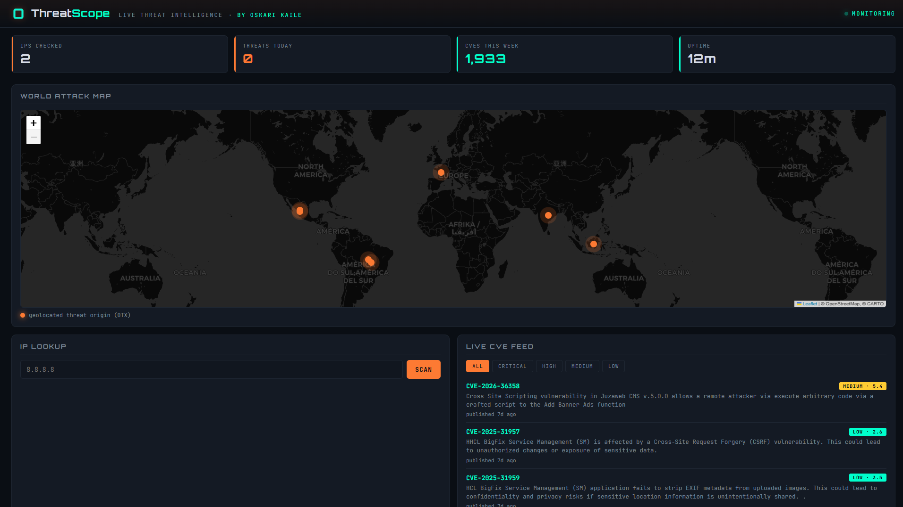

# ThreatScope — Threat Intelligence Dashboard

**[Live demo →](https://oskarikaile.github.io/ThreatScope/)**

A full-stack cybersecurity threat intelligence dashboard. Track live CVEs from NVD, look up IP reputation via AbuseIPDB, surface active malware campaigns and threat actors from AlienVault OTX, and watch geolocated attack origins on a world map — all in one dark-ops console.



> Built by [Oskari Kaile](https://oskarikaile.github.io/)

---

## Features

- **IP Lookup** — AbuseIPDB confidence score, country flag, ISP, report count, threat categories
- **Live CVE Feed** — latest CVEs from the NVD, filter by severity (Critical / High / Medium / Low)
- **Threat Feed** — malware campaigns, threat actors, and affected countries from AlienVault OTX
- **World Attack Map** — geolocated threat markers rendered with Leaflet + dark Carto tiles
- **Stats bar** — IPs checked, threats today, CVEs this week, uptime
- **Mock-data fallback** — works fully out of the box without API keys for instant demos

---

## Tech

- **Node.js + Express** — thin API proxy that keeps keys server-side and normalizes upstream responses
- **Leaflet** — world map with custom dark tile layer and pulsing threat markers
- **AbuseIPDB · NVD · AlienVault OTX** — upstream threat intelligence sources
- Vanilla JS + CSS on the front end, no framework, no bundler

---

## Project structure

```
├── server.js               # Express server, API proxy routes
├── package.json            # Dependencies
├── public/
│   ├── index.html          # Shell, HUD markup
│   ├── styles.css          # All styles — dark-ops aesthetic
│   ├── app.js              # Front-end logic, map, feeds, IP lookup
│   └── assets/
│       ├── O-logo.png      # Logo
│       ├── O.png           # Favicon
│       └── screenshot.png  # Screenshot of the project
└── README.md
```

---

## Data sources

| Source | Purpose | Key required |
|---|---|---|
| [AbuseIPDB](https://www.abuseipdb.com/account/api) | IP reputation & abuse reports | Yes (free) |
| [NVD](https://nvd.nist.gov/developers) | CVE feed | No |
| [AlienVault OTX](https://otx.alienvault.com/api) | Threat campaigns & actors | Yes (free) |

Without keys, ThreatScope serves realistic mock data so the dashboard still works.

---

## Running locally

```powershell
cd C:\Users\oskar_kq0lbxn\Desktop\Code\ThreatScope
npm install
copy .env.example .env   # optional — fill in API keys for live data
npm start
```

Then open `http://localhost:3000`.

---

## Palette

| Token | Hex | Usage |
|---|---|---|
| `--accent` | `#FD7A33` | Primary orange — highs, alerts, map markers |
| `--accent2` | `#00FFCC` | Cyan — success, OTX accents, links |
| `--bg` | `#0a0e14` | Console background |

---

## License

MIT
